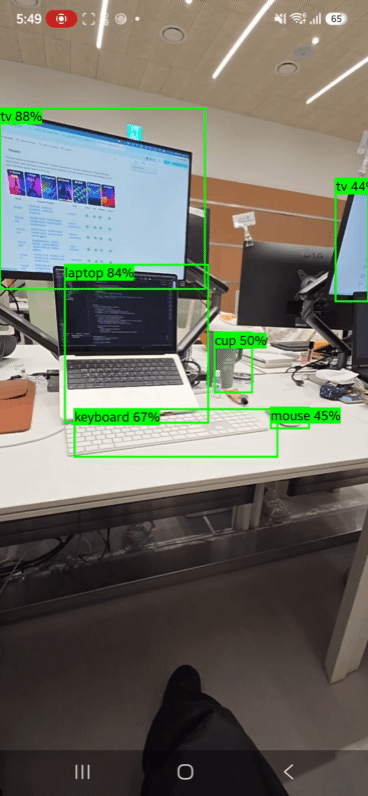

# yolo_aos
YOLO26n 모델을 활용한 OnDevice AI 사물 인식 (Android)

카메라 화면 위에 AI 인식 결과를 실시간으로 그리는 앱입니다. 첫 화면에서 두 엔진 중 하나를 고릅니다.

- **YOLO26n**: 검출, 분할, 깊이, 자세
- **MediaPipe**: 배경 분리, 사물 검출, 이미지 분류, 얼굴, 손·제스처, 자세

서버 없이 모든 추론을 기기 안에서 처리합니다.

<p align="center">
  
  <br />
  <sub>실기기 사물 검출 화면 (YOLO11n 버전에서 녹화)</sub>
</p>

## 주요 기능

### 공통
- 첫 화면에서 엔진 선택, 뒤로가기로 첫 화면 복귀
- CameraX 카메라 프리뷰 (전체 화면, 권한 요청 포함)

### YOLO26n
하단 버튼으로 기능을 전환합니다.

| 기능 | 화면에 보이는 것 |
| --- | --- |
| 검출 | 박스 + 라벨(`이름 점수%`), COCO 80종. 프레임 간 위치 보간으로 박스가 부드럽게 이동 |
| 분할 | 사물 윤곽대로 반투명 색칠 + 박스·라벨, COCO 80종 |
| 깊이 | 화면 전체를 거리별 색으로 표시 (가까움 빨강 → 멂 파랑) |
| 자세 | 사람마다 관절 17개 골격 |

- 라벨·입력 크기·클래스 수를 모델 파일에서 자동으로 읽음 → 모델 파일만 바꾸면 커스텀 모델 사용 가능
- GPU 델리게이트 우선 시도, 실패 시 CPU(4스레드)로 자동 전환

### MediaPipe
하단 버튼으로 기능을 전환합니다. 전면/후면 카메라 전환을 지원합니다(전면은 거울 화면에 맞춰 결과도 반전).

| 기능 | 화면에 보이는 것 |
| --- | --- |
| 배경 분리 | 사람만 남기고 배경을 검정으로 지움. "배경 흐림"을 켜면 배경만 흐리게 |
| 사물 검출 | 박스 + 라벨 (COCO 계열 사물) |
| 이미지 분류 | 화면 전체에 대한 상위 3개 분류 결과 (ImageNet 1000종) |
| 얼굴 | 얼굴 점 478개 + 표정 상위 3개 (예: `eyeBlinkLeft`, `mouthSmileRight`) |
| 손·제스처 | 손 관절 21개 골격(최대 2손) + 제스처 이름 |
| 자세 | 전신 관절 33개 골격 |

손·제스처에서 인식하는 제스처는 `Thumb_Up`, `Thumb_Down`, `Victory`, `Closed_Fist`, `Open_Palm`, `Pointing_Up`, `ILoveYou` 7종이며, 그 외 손 모양은 `None`으로 표시됩니다.

## 기술 스택

| 구분 | 내용 |
| --- | --- |
| 언어 / UI | Kotlin 2.2, Jetpack Compose (Material3) |
| 카메라 | CameraX 1.6.2 (`LifecycleCameraController`, `PreviewView`) |
| 추론 (YOLO) | LiteRT 1.4.2 (`litert`, `litert-gpu`) |
| 추론 (MediaPipe) | MediaPipe Tasks Vision 1.0.0 (`tasks-vision`) |
| 모델 | YOLO26n `.tflite` 4종 + MediaPipe 공식 모델 6종 |
| 빌드 | AGP 9.4.1, minSdk 26, targetSdk 37 |

## 프로젝트 구조

```
app/src/main/
├── assets/
│   ├── yolo26n.tflite                # YOLO 검출 (메타데이터 포함)
│   ├── yolo26n-seg.tflite            # YOLO 분할
│   ├── yolo26n-depth.tflite          # YOLO 깊이
│   ├── yolo26n-pose.tflite           # YOLO 자세
│   ├── selfie_segmenter.tflite       # MediaPipe 배경 분리
│   ├── efficientdet_lite0.tflite     # MediaPipe 사물 검출
│   ├── efficientnet_lite0.tflite     # MediaPipe 이미지 분류
│   ├── face_landmarker.task          # MediaPipe 얼굴
│   ├── gesture_recognizer.task       # MediaPipe 손·제스처
│   └── pose_landmarker_lite.task     # MediaPipe 자세
├── java/hydok/yolo/
│   ├── MainActivity.kt               # 권한, 엔진 선택 화면, YOLO 카메라 화면·기능 전환·오버레이
│   ├── YoloDetector.kt               # YOLO 4개 기능 모델 로드, 전처리, 추론, 후처리
│   ├── mediapipe/
│   │   ├── MediaPipeAnalyzer.kt      # MediaPipe 6개 기능 모델 로드, 추론, 배경 합성
│   │   └── MediaPipeScreen.kt        # MediaPipe 카메라 화면, 기능 전환, 결과 그리기
│   └── ui/theme/                     # Compose 테마
└── AndroidManifest.xml               # CAMERA 권한
```

## 동작 방식

### YOLO26n

```
카메라 프레임 (ImageAnalysis, RGBA)
  → 프리뷰에 보이는 영역만 크롭 → 회전 보정 → 640×640 레터박스 (남는 곳은 회색)
  → NCHW float32 (0~1) 변환
  → LiteRT 추론
  → 기능별 후처리 (아래)
  → 레터박스 좌표를 프리뷰 기준(0~1)으로 환산
  → Compose Canvas에 그리기
```

- **검출**: 신뢰도 0.4 이상 후보 추림 → 클래스별 NMS (IoU 0.5) → 박스를 매 화면 프레임마다 30%씩 새 위치로 보간
- **분할**: 검출과 같은 방식으로 박스를 고른 뒤, 박스마다 마스크 계수 32개와 마스크 원형(160×160) 32장을 곱해 더함 → 0보다 큰 픽셀을 박스 안에서만 색칠
- **깊이**: 픽셀마다 거리(미터 추정값)가 나옴 → 화면 안 최솟값~최댓값을 색으로 매핑. 절대 거리보다 상대적인 멀고 가까움을 보는 용도
- **자세**: 사람 박스를 NMS로 고른 뒤, 관절별 가시성 0.5 이상인 점만 연결
- 모델 입력은 비율을 유지하는 레터박스 방식입니다. 늘려서 맞추면 사물이 찌그러져 정확도가 떨어집니다.
- 기능을 바꾸면 이전 모델을 닫고 새 모델을 불러옵니다.

### MediaPipe

```
카메라 프레임 (ImageAnalysis, RGBA)
  → 프리뷰에 보이는 영역만 크롭 → 회전 보정 (Bitmap)
  → 선택한 기능의 MediaPipe Task 실행 (VIDEO 모드)
  → 결과를 프리뷰 기준 좌표(0~1)로 정리
  → Compose Canvas에 그리기 (전면 카메라면 좌우 반전)
```

- 크기 조정, 정규화, 후처리는 MediaPipe가 내부에서 처리합니다.
- 배경 분리는 픽셀마다 사람일 확률(0~1)을 받아, 원본과 배경(검정 또는 흐린 이미지)을 그 비율로 섞습니다. 그래서 경계가 부드럽게 처리됩니다.
- 기능을 바꾸면 이전 모델을 닫고 새 모델을 불러옵니다.

두 엔진 모두 분석은 별도 단일 스레드에서 돌고, 처리 중 들어온 프레임은 버립니다(최신 프레임만 처리).

## YOLO 모델 규격

네 모델 모두 입력은 `[1, 3, 640, 640]` float32, RGB, 0~1, **NCHW**입니다. 일반적인 TFLite 예제(NHWC)와 채널 순서가 다르니 주의하세요.

| 기능 | 파일 | 크기 | 출력 |
| --- | --- | --- | --- |
| 검출 | `yolo26n.tflite` | 10.0MB | `[1, 84, 8400]` — `cx, cy, w, h`(0~1) + 클래스 점수 80개 |
| 분할 | `yolo26n-seg.tflite` | 11.3MB | `[1, 116, 8400]` — 검출과 같음 + 마스크 계수 32개 / `[1, 32, 160, 160]` 마스크 원형 |
| 깊이 | `yolo26n-depth.tflite` | 20.8MB | `[1, 1, 640, 640]` — 픽셀별 거리(미터) |
| 자세 | `yolo26n-pose.tflite` | 12.2MB | `[1, 56, 8400]` — `cx, cy, w, h` + 사람 점수 + 관절 17개 × (`x, y, 가시성`) |

- 좌표는 모두 640×640 입력 기준 0~1로 정규화되어 나옵니다.
- NMS는 포함되지 않아 앱에서 처리합니다. (YOLO26은 원래 NMS 없는 구조를 지원하지만, 이번 LiteRT 변환본은 그 기능이 꺼진 형식으로 나옵니다.)
- 모델 파일 끝에 zip으로 `metadata.json`이 붙어 있습니다 (`names`, `imgsz`, 자세 모델은 `kpt_shape` 등).
- 깊이 모델은 연산량이 검출의 약 6배(32.5 GFLOPs)라 가장 느립니다.

## MediaPipe 모델

모두 [MediaPipe 공식 모델](https://ai.google.dev/edge/mediapipe/solutions/guide)이며 변환 없이 그대로 사용합니다.

| 기능 | 파일 | 크기 | 정밀도 |
| --- | --- | --- | --- |
| 배경 분리 | `selfie_segmenter.tflite` | 0.25MB | float16 |
| 사물 검출 | `efficientdet_lite0.tflite` | 4.6MB | int8 |
| 이미지 분류 | `efficientnet_lite0.tflite` | 5.4MB | int8 |
| 얼굴 | `face_landmarker.task` | 3.8MB | float16 |
| 손·제스처 | `gesture_recognizer.task` | 8.4MB | float16 |
| 자세 | `pose_landmarker_lite.task` | 5.8MB | float16 |

다른 모델로 바꾸려면 파일을 `assets/`에 넣고 `MediaPipeAnalyzer.kt`의 `MpMode`에서 파일 이름을 수정하세요. 예를 들어 자세를 더 정확하게 하려면 `pose_landmarker_full.task`로 바꿀 수 있습니다(더 무겁고 느림).

MediaPipe는 모델을 압축 없이 읽어야 해서 `app/build.gradle.kts`에 `noCompress += listOf("tflite", "task")`를 설정했습니다.

## YOLO 모델 다시 만들기

Python 3.12 환경에서 진행했습니다. (3.14는 변환 도구 호환 문제가 있음)

```bash
python3.12 -m venv venv
```

```bash
./venv/bin/pip install ultralytics
```

기능별로 한 번씩 내보냅니다. 가중치 파일은 처음 실행할 때 자동으로 내려받습니다.

```bash
./venv/bin/yolo export model=yolo26n.pt format=tflite imgsz=640
```

```bash
./venv/bin/yolo export model=yolo26n-seg.pt format=tflite imgsz=640
```

```bash
./venv/bin/yolo export model=yolo26n-depth.pt format=tflite imgsz=640
```

```bash
./venv/bin/yolo export model=yolo26n-pose.pt format=tflite imgsz=640
```

생성된 `.tflite` 파일을 `app/src/main/assets/`에 넣으면 됩니다. (`format=tflite`는 현재 `litert` 포맷으로 자동 전환되어 내보내집니다.)

### 커스텀 모델 사용

직접 학습한 YOLO 검출·분할·자세 모델도 같은 방식으로 내보내 해당 파일을 교체하면 됩니다. 라벨, 입력 크기, 클래스 수는 모델에서 읽으므로 코드 수정이 필요 없습니다. 파일 이름을 바꾸려면 `YoloDetector.kt`의 `YoloTask`에서 수정하세요.

## 조정 가능한 값

### YOLO

| 값 | 위치 | 기본값 | 설명 |
| --- | --- | --- | --- |
| `CONFIDENCE_THRESHOLD` | `YoloDetector.kt` | 0.4 | 낮추면 더 많이 잡고 오검출도 늘어남 |
| `IOU_THRESHOLD` | `YoloDetector.kt` | 0.5 | 겹친 박스를 하나로 합치는 기준 |
| `KEYPOINT_THRESHOLD` | `YoloDetector.kt` | 0.5 | 자세에서 이 값보다 가시성이 낮은 관절은 그리지 않음 |
| `SMOOTHING` | `MainActivity.kt` | 0.3 | 높이면 박스가 빨리 따라붙고, 낮추면 더 부드러움 |

### MediaPipe (`MediaPipeAnalyzer.kt`)

| 값 | 기본값 | 설명 |
| --- | --- | --- |
| 사물 검출 `setScoreThreshold` / `setMaxResults` | 0.4 / 10 | 표시할 최소 점수와 최대 개수 |
| 이미지 분류 `setMaxResults` | 3 | 표시할 분류 결과 수 |
| 얼굴 `setNumFaces` | 2 | 동시에 인식할 얼굴 수 |
| 손 `setNumHands` | 2 | 동시에 인식할 손 수 |
| 배경 흐림 정도 (`composite`의 `/ 16`) | 16 | 크게 할수록 더 흐림 |

## 참고 사항

- **LiteRT 버전**: 최신 2.x(2.1.6, 2.2.0)는 `litert`와 `litert-api`의 네임스페이스 충돌로 이 AGP 버전에서 빌드가 실패해 1.4.2를 사용합니다.
- **GPU**: YOLO는 GPU를 먼저 시도하고, 실패하면 CPU를 씁니다(에뮬레이터는 CPU). MediaPipe는 CPU로 추론합니다.
- **APK 크기**: 디버그 APK는 약 179MB입니다. 4가지 CPU 아키텍처용 네이티브 라이브러리와 압축하지 않은 모델(YOLO 54MB + MediaPipe 28MB)이 들어 있기 때문입니다. 플레이스토어(AAB) 배포 시 사용자는 자기 폰에 맞는 아키텍처만 받으므로 훨씬 작아집니다.
- **표시 언어**: 분류, 표정, 제스처 결과는 모델이 주는 영어 이름 그대로 표시됩니다.
- **라이선스**: YOLO26 모델은 Ultralytics의 AGPL-3.0 라이선스를 따르므로, YOLO를 포함해 배포할 때는 AGPL 조건 확인이 필요합니다. MediaPipe 라이브러리는 Apache-2.0이며, 각 모델의 라이선스는 MediaPipe 문서의 모델 카드에서 확인하세요. 자세한 내용은 [LICENSES.md](LICENSES.md)를 참고하세요.
